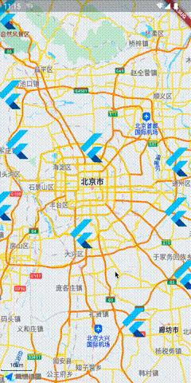
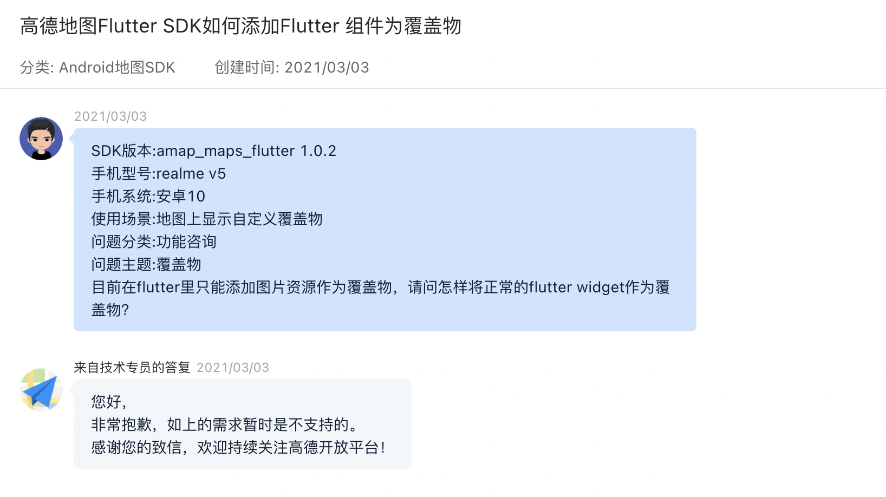
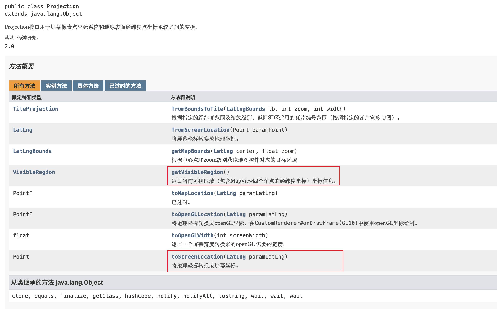
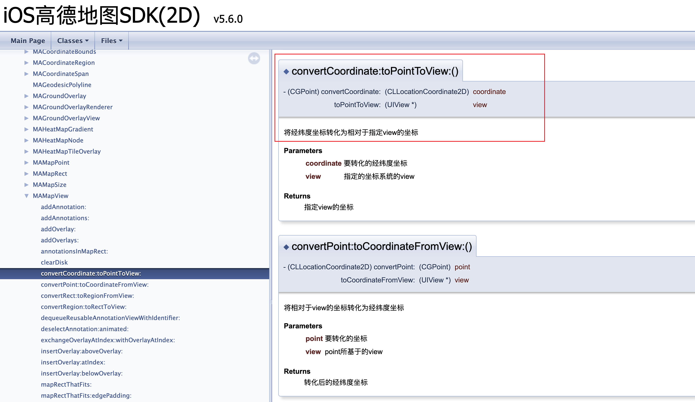

# Flutter_Amap_Marker



使用 Flutter Widget 作为高德地图覆盖物

## 背景



早在 2021 年初，公司的一个 LBS 产品为了完成一些比较炫酷的交互动效和转场效果，需要在高德地图上方使用 Flutter 原生组件作为遮罩物。奈何当时在整个 Flutter 生态下，国内三大地图厂商提供的，或官方或民间的 Flutter 地图插件，均不支持此特性。 无奈没有现成的轮子，只能自己造了。

## 问题分析

首先，我们知道在 Flutter 中这类地图组件大多是内嵌到 Flutter 视图内的平台原生组件，故我们无法直接在其上层直接绑定 Flutter Widget 作为覆盖物。一个思路是将当前组件转换成图片，然后通过原生的 Marker 接口，将图片渲染到地图上。不过这种方法的弊端显而易见，那就是图片是静态的，无法做一些动画或复杂交互，因为此时地图 marker 层与 Flutter 环境仍然是相互隔离的两个容器，故此方案不通。

既然将组件转成图片这条路不通，那我们必须要找到一种方法将地图视图与 Flutter 层绑定才能达到相同的效果。那么怎样将地图视图与 Flutter 绑定呢？

方法很简单，只要知道每个时刻地图的经纬度边界，我们就可以通过墨卡托投影拿到每个地理位置在屏幕中的投影坐标。此时只要在地图组件上方覆盖一层 marker 层，通过调节每个 marker 的 position 即可完成绑定。此方案的优势在于，marker 层完全由 Flutter 端控制渲染，灵活度极高，可满足各种业务需求。

## 解决方案

通过查询高德地图官方SDK文档可知，Android端有 `Projection.toScreenLocation` 方法， iOS端有`MAMapView.convertCoordinate:toPointToView` 方法，可以将经纬度坐标转换为屏幕坐标。

|||
|:---:|:---:|

下面我们在高德地图官方 amap_flutter_map 插件 v3.0 版本的基础上扩展一下，将这两个方法暴露出来。

先来看下Android端：

```java
// android/src/main/java/com/amap/flutter/map/core/MapController.java 148 行
case Const.METHOD_MAP_GET_SCREEN_LOCATION:
  if (null != amap) {
      LatLng location = new LatLng(call.argument("latitude"), call.argument("longitude"));
      Point position = amap.getProjection().toScreenLocation(location);
      result.success(ConvertUtil.pointToMap(position));
  }
  break;

// android/src/main/java/com/amap/flutter/map/utils/ConvertUtil.java 182 行
public static Object pointToMap(Point point) {
    if (point == null) {
        return null;
    }
    final Map<String, Object> data = new HashMap<>();
    data.put("x", point.x);
    data.put("y", point.y);
    return data;
}
```

接着看下iOS端：

```Objective-C
// ios/Classes/AMapViewController.m 236 行
[self.channel addMethodName:@"map#screenLocation" withHandler:^(FlutterMethodCall * _Nonnull call, FlutterResult  _Nonnull result) {
    double latitude = [call.arguments[@"latitude"] doubleValue];
    double longitude = [call.arguments[@"longitude"] doubleValue];
    CGPoint position = [weakSelf.mapView convertCoordinate:CLLocationCoordinate2DMake(latitude, longitude) toPointToView:weakSelf.mapView];
    result(@{
        @"x":@(position.x),
        @"y":@(position.y),
    });
}];
```

最后 Dart 端对齐一下接口：

```dart
// lib/src/core/method_channel_amap_flutter_map.dart 274 行
/// 获取屏幕点坐标
Future<Map?> screenLocation(LatLng location, {required int mapId}) async {
  return channel(mapId)
      .invokeMethod<Map>('map#screenLocation', <String, dynamic>{
    'latitude': location.latitude,
    'longitude': location.longitude,
  });
}

// lib/src/amap_controller.dart 150 行
/// 获取屏幕点坐标
Future<Map?> screenLocation(LatLng location) async {
  return _methodChannel.screenLocation(location, mapId: mapId);
}
```

OK，准备工作完成，最后改造一下 AmapWidget

```dart
// lib/src/amap_marker_controller.dart
part of amap_flutter_map;

class FlutterMarker {
  final LatLng latlng;
  final Widget child;
  Point? position;
  FlutterMarker({
    required this.latlng,
    required this.child,
  });
}

class MarkersStack extends StatefulWidget {
  final AmapMarkerController controller;
  const MarkersStack({required this.controller, Key? key}) : super(key: key);

  @override
  State<MarkersStack> createState() => _MarkersStackState();
}

class _MarkersStackState extends State<MarkersStack> {
  void rebuild() {
    setState(() {});
  }

  @override
  Widget build(BuildContext context) {
    widget.controller.rebuildMarkersCallback = rebuild;
    return Stack(
      children: widget.controller.markers
          .map<Widget>(
            (e) => Positioned(
              left: (e.position?.x ?? 0.0) as double,
              top: (e.position?.y ?? 0.0) as double,
              child: Offstage(
                offstage: e.position == null,
                child: e.child,
              ),
            ),
          )
          .toList(),
    );
  }
}

class AmapMarkerController {

  ///地图控制器
  AMapController? controller;

  ///地图覆盖物
  List<FlutterMarker> _markers = [];

  ///marker刷新回调
  Function? rebuildMarkersCallback;

  List<FlutterMarker> get markers => _markers;

  void setMarkers(List<FlutterMarker> markers) {
    _markers = markers;
    updateMarkers();
  }

  ///更新覆盖物
  Future<void> updateMarkers() async {
    if (_markers.isEmpty) return;
    for (var marker in _markers) {
      marker.position = await map2screen(marker.latlng);
    }
    rebuildMarkersCallback?.call();
  }

  ///经纬度转屏幕坐标
  ///
  ///返回Point(x,y)（不在屏幕中为null）
  Future<Point<double>?> map2screen(LatLng? location) async {
    if (_markers.isEmpty || location == null || controller == null) {
      return Future.value(null);
    }
    final result = await controller!.screenLocation(location);
    final p = Platform.isAndroid ? window.devicePixelRatio : 1;
    return result == null
        ? null
        : Point<double>(result["x"] / p, result["y"] / p);
  }
}
```


## 优化扩展


通过 `screenLocation` 方法拿到地图坐标对应屏幕坐标的方式虽然简单可靠，不过当遮罩物数量过多时，Flutter 与原生平台间的异步通信就会成为性能瓶颈，造成卡顿甚至服务不可用。上面我们提到，只要知道每个时刻地图的经纬度边界，我们就可以通过墨卡托投影拿到每个地理位置在屏幕中的投影坐标。此种方式只需要在地图移动时更新一次地图经纬度边界，即与原生平台端通信一次即可，后续位置映射相关的计算可在 Dart 层实时处理，极大节省了通信成本。不过此方式的缺点是不支持地图旋转和俯仰角变化，读者可以综合性能与实际需求，酌情取舍两种方案。

## 使用示例
``` Dart
import 'package:flutter/material.dart';
import 'package:amap_flutter_map/amap_flutter_map.dart';
import 'package:amap_flutter_base/amap_flutter_base.dart';

void main() {
  runApp(MaterialApp(home: MapPage()));
}

class MapPage extends StatelessWidget {
  @override
  Widget build(BuildContext context) {
    return Scaffold(
      body: AMapWidget(
        flutterMarkers: [
          FlutterMarker(
            latlng: LatLng(39.909187, 116.397451),
            child: FlutterLogo(size: 64),
          )
        ],
      ),
    );
  }
}

```

## 其他说明

本项目修改自高德地图官方 amap_flutter_map 插件 v3.0 版本，作为「Flutter组件做地图覆盖物」相关思路的演示。

代码仅供参考，请勿直接用于生产环境！

## 相关链接

1. 高德地图官方 amap_flutter_map 插件文档：https://pub.flutter-io.cn/packages/amap_flutter_map
2. 高德地图 Android 原生 SDK 接口文档：https://a.amap.com/lbs/static/unzip/AMap_HarmonyOS_API_3DMap_Doc/overview-summary.html
3. 高德地图 iOS 原生 SDK 接口文档：https://a.amap.com/lbs/static/unzip/iOS_Map_Doc/AMap_iOS_API_Doc_2D/interface_m_a_map_view.html


